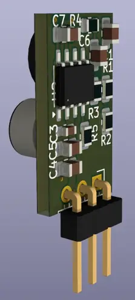
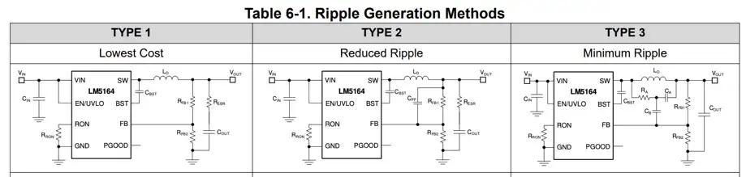

|      |   |         |
|------|---|---------|
| Vin  | 6 | 100     |
| Vout |   |         |
| Iout |   | 0.5     |
| fsw  |   | 1000khz |

* [LM5163](https://www.ti.com/lit/ds/symlink/lm5163.pdf) (.5A)
* [LM5164](https://www.ti.com/lit/ds/symlink/lm5164.pdf) (1A)
* sync buck with nearly 100% max duty cycle
* 0.725Ω NFET buck switch, 0.34Ω NFET synchronous rectifier
* constant on-time (COT) control architecture
* light-load power saving mode
* 10.5µA no-load input quiescent current
* soft-start, UVLO, thermal shutdown
* PGOOD indicator

## inductors

requirements:

* Isat well above current limit setting
* Isat decreases with rising temperature
* refer to datasheet [pg 18](https://www.ti.com/lit/ds/symlink/lm5163.pdf#page=18)

|                      | L     | Isat(30%) | DCRmΩ(max) | Q         | px(250) | size | Notes                                                                                           |
|----------------------|-------|-----------|------------|-----------|---------|------|-------------------------------------------------------------------------------------------------|
| MSS1260-124KL        | 120uH | 2A        | 195        |           | 1,33€   | 12mm | LM5163 datasheet                                                                                |
| Bourns SRN6045-101M  | 100uH | .7A       | 494        | 22@796kHz | $,27    | 6mm  |                                                                                                 |
| VLS5045EX-101M       | 100uH | .7A       | 754        |           | $,20    | 5mm  | ordered                                                                                         |
| → TY NRS8040T101MJGK | 100uH | 1.1A      | 364        |           | $,22    | 8mm  | [pdf](https://mm.digikey.com/Volume0/opasdata/d220001/medias/docus/2544/NRS8040T101MJGK_SS.pdf) |
|                      |       |           |            |           |         |      |                                                                                                 |
|                      |       |           |            |           |         |      |                                                                                                 |

